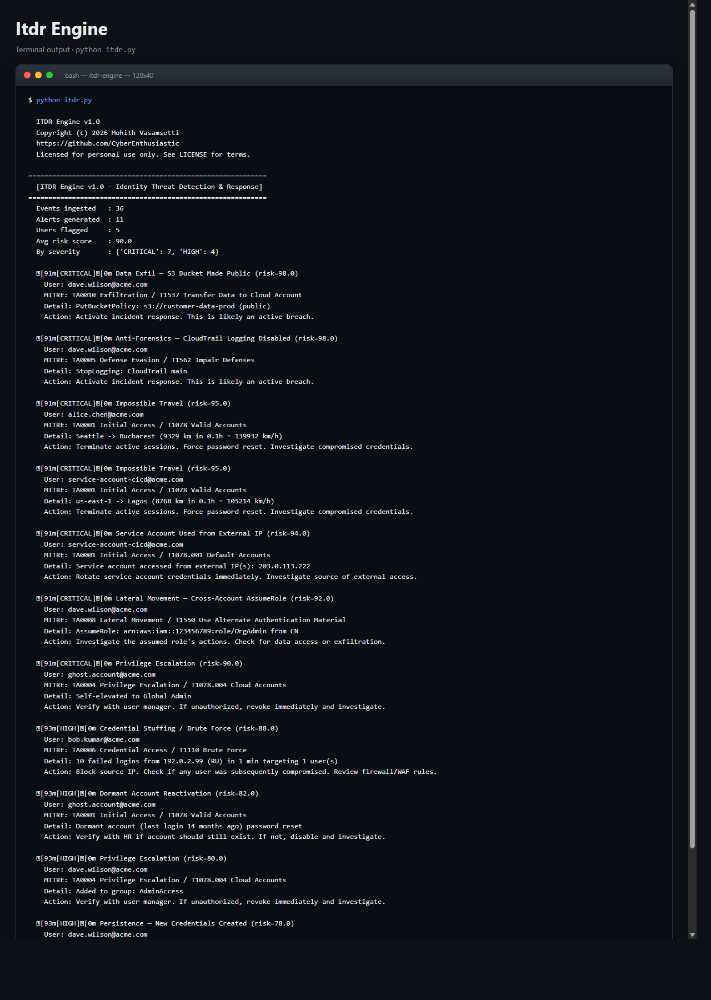
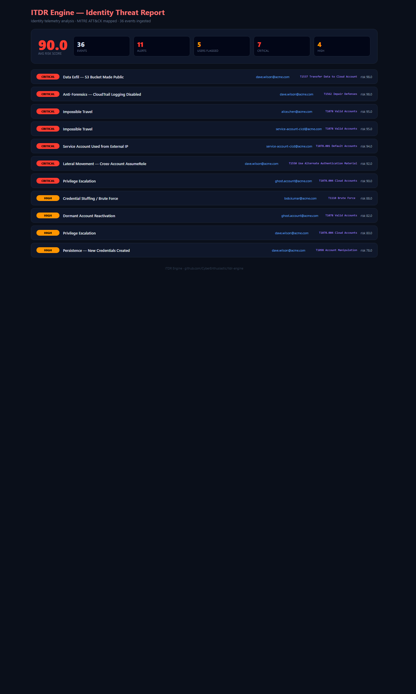

# ITDR Engine -- Identity Threat Detection & Response

> **Behavioral identity analytics -- 9 detection rules, MITRE ATT&CK mapped, zero dependencies.**
> A free, self-hosted alternative to CrowdStrike Identity Threat Protection, Microsoft Entra ID Protection, and Semperis for teams that want identity security without the enterprise spend.

[](./LICENSE)
[](https://www.python.org/downloads/)
[-brightgreen.svg)]()
[](https://attack.mitre.org/)

---

## What it does

Ingests identity event logs (authentication, privilege changes, access patterns)
and runs 9 behavioral detection rules to flag compromised accounts, insider
threats, and identity-based attacks. Every alert maps to a MITRE ATT&CK
technique with risk scoring and response recommendations.

```
============================================================
  ITDR Engine v1.0 -- Identity Threat Detection & Response
============================================================
[*] Events analyzed  : 36
[*] Alerts generated : 11
[*] Users flagged    : 5
[*] Avg risk score   : 90.0
[*] Severity         : {'CRITICAL': 7, 'HIGH': 3, 'MEDIUM': 1}

[CRITICAL] Impossible Travel (T1078) -- john.doe@corp.com, risk 95
   London -> Tokyo in 47 min (14,200 km)

[CRITICAL] MFA Fatigue (T1621) -- jane.smith@corp.com, risk 92
   12 MFA pushes in 3 min, then approved

[CRITICAL] Privilege Escalation (T1078.004) -- contractor@corp.com, risk 98
   Global Admin granted at 02:47 AM outside change window
```

---

## Screenshots (ran locally, zero setup)

**Terminal output** - exactly what you see on the command line:



**Interactive HTML dashboard** - opens in any browser, dark-mode, filterable:



Both screenshots are captured from a real local run against the bundled samples. Reproduce them with the quickstart commands below.

---

## Why you want this

| | **ITDR Engine** | CrowdStrike ITP | Entra ID Protection | Semperis |
|---|---|---|---|---|
| **Price** | Free (MIT) | $$$$ | $$$$ (E5 license) | $$$$ |
| **Runtime deps** | **None** -- pure stdlib | Cloud agent | Azure AD | AD-integrated |
| **Install time** | `git clone && python itdr.py` | Weeks | Azure setup | Weeks |
| **Self-hosted** | Yes | No (SaaS) | No (SaaS) | On-prem |
| **MITRE ATT&CK mapping** | Per alert | Yes | Limited | Yes |
| **Detections** | 9 behavioral rules | Proprietary | Risk-based | AD-focused |
| **Risk scoring** | 0-100 per alert | Proprietary | Low/Med/High | Proprietary |

---

## 60-second quickstart

```bash
git clone https://github.com/CyberEnthusiastic/itdr-engine.git
cd itdr-engine
python itdr.py
```

### One-command installer

```bash
./install.sh          # Linux / macOS / WSL / Git Bash
.\install.ps1         # Windows PowerShell
```

---

## 9 detection rules (MITRE ATT&CK mapped)

| ID | Detection | Severity | MITRE ATT&CK | What it catches |
|----|-----------|----------|--------------|-----------------|
| ITDR-001 | Impossible Travel | CRITICAL | T1078 | Login from two distant locations faster than travel allows |
| ITDR-002 | Brute Force | CRITICAL | T1110 | Repeated failed logins followed by success |
| ITDR-003 | MFA Fatigue | CRITICAL | T1621 | Rapid MFA push spam until user accepts |
| ITDR-004 | Privilege Escalation | CRITICAL | T1078.004 | Admin rights granted outside change windows |
| ITDR-005 | Persistence | HIGH | T1098 | New credentials or keys added to service accounts |
| ITDR-006 | Lateral Movement | HIGH | T1021 | Single identity accessing many systems in short window |
| ITDR-007 | Data Exfiltration | HIGH | T1567 | Bulk downloads or unusual data access patterns |
| ITDR-008 | Dormant Reactivation | MEDIUM | T1078.001 | Inactive account (90+ days) suddenly active |
| ITDR-009 | Service Account Anomaly | CRITICAL | T1078.001 | Service account used interactively or from new IP |

---

## How to run

```bash
# Run the full detection engine against sample events
python itdr.py

# Windows
python itdr.py
start reports\itdr_report.html

# macOS
python itdr.py
open reports/itdr_report.html

# Linux
python itdr.py
xdg-open reports/itdr_report.html
```

---

## How to uninstall

```bash
./uninstall.sh        # Linux / macOS / WSL / Git Bash
.\uninstall.ps1       # Windows PowerShell
```

---

## Project layout

```
itdr-engine/
├── itdr.py               # main engine -- 9 behavioral detections + risk scorer
├── report_generator.py   # HTML report builder
├── data/
│   └── identity_events.json  # sample identity events (36 events, 5 users)
├── reports/              # generated HTML reports (gitignored)
├── .vscode/              # extensions.json, settings.json
├── Dockerfile            # containerized runs
├── install.sh            # installer (Linux/Mac/WSL)
├── install.ps1           # installer (Windows)
├── uninstall.sh          # uninstaller (Linux/Mac/WSL)
├── uninstall.ps1         # uninstaller (Windows)
├── requirements.txt      # empty -- pure stdlib
├── LICENSE               # MIT
├── NOTICE                # attribution
├── SECURITY.md           # vulnerability disclosure
└── CONTRIBUTING.md       # how to send PRs
```

---

## License

MIT. See [LICENSE](./LICENSE) and [NOTICE](./NOTICE).

---

Built by **[Mohith Vasamsetti (CyberEnthusiastic)](https://github.com/CyberEnthusiastic)** as part of the [AI Security Projects](https://github.com/CyberEnthusiastic?tab=repositories) suite.
